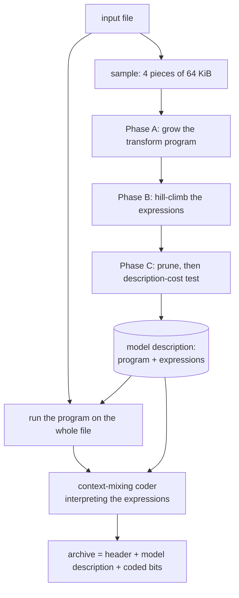
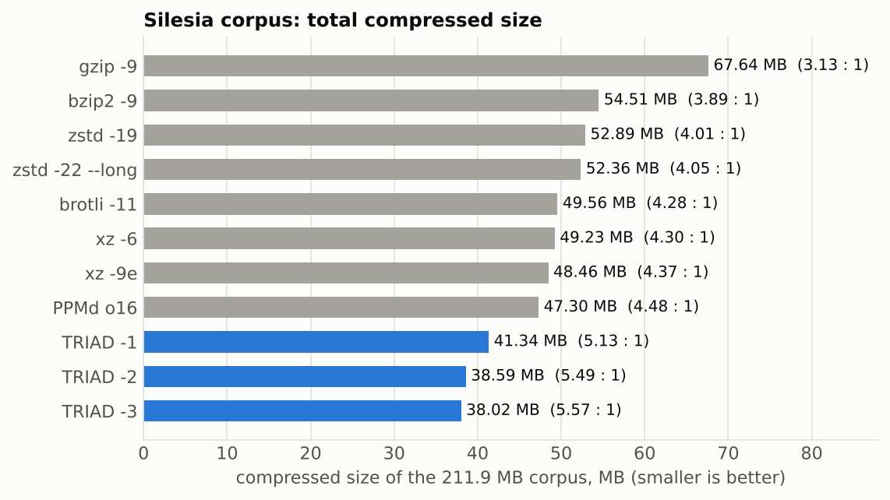
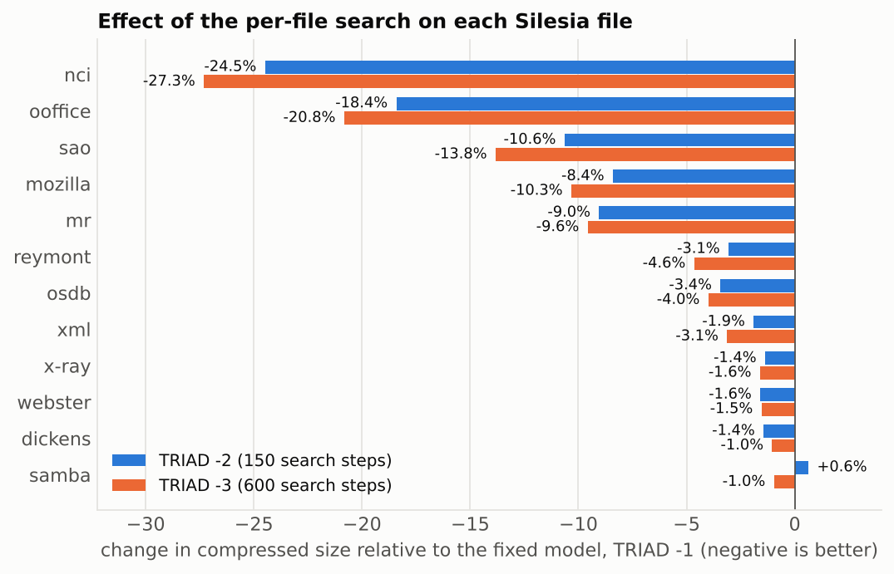
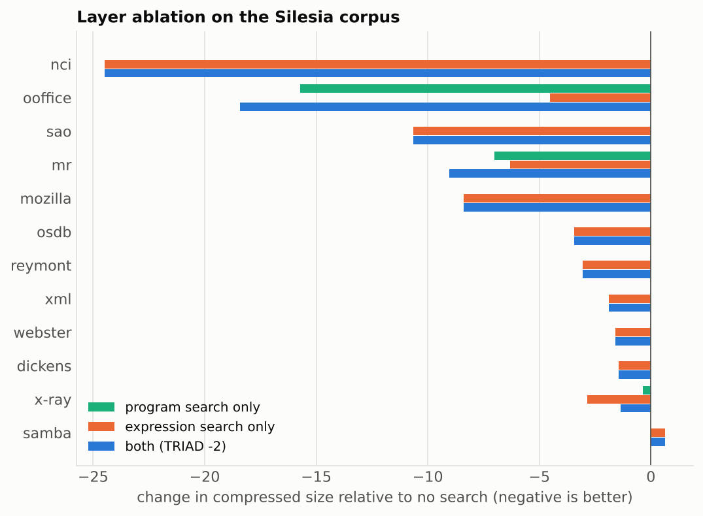
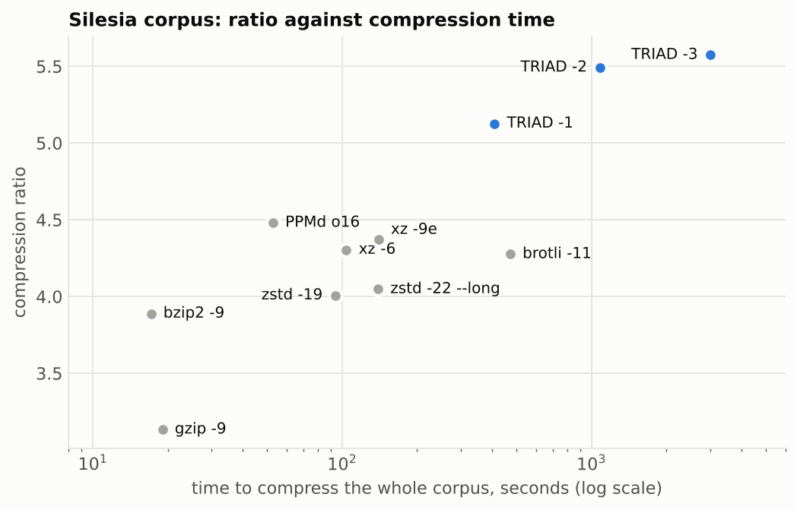

# TRIAD: Per-File Search over Self-Describing Context-Mixing Models for Lossless Compression

*A procedural, functional and iterative design*

**Author:** *Jamshid Nakkhchivanski* · October 2026 · Source code: `[src/triad.c](src/triad.c)`

---

## Abstract

General-purpose lossless compressors ship with a fixed statistical model, and
the strongest of them owe much of their strength to models that developers
wrote by hand for particular kinds of data. We study the alternative in which
the encoder *finds* a model for each file and tells the decoder what it found.
TRIAD combines three layers. A *procedural* layer stores a short program of
reversible steps (an x86 address fix-up and typed deltas) that the decoder
undoes. A *functional* layer writes every statistical context as an expression
over eight combinators (byte at a distance, column, word hash, byte above,
gradient, …); the expressions are stored in the archive and interpreted by a
generic context-mixing decoder. An *iterative* layer searches for the program
and the expressions per file by hill climbing, using the measured coding cost
on a 256 KiB sample as the only criterion, and keeps the result only if it
pays for its own description. On the Silesia corpus (212 MB) TRIAD produces
38.59 MB at its default level and 38.02 MB with a longer search, against
48.46 MB for `xz -9e` and 47.30 MB for PPMd: 20.4 % and 21.5 % smaller than
`xz -9e`. The search itself accounts for 6.6 % and 8.0 % of that over the same
coder with a fixed model, and for up to 27 % on structured files. On a
synthetic 64-bit quadratic sequence the search finds a two-step program that
reduces 1.6 MB to 783 bytes, where `xz -9e` needs 543 kB. The price is speed
and memory: about 0.5 MB/s in both directions and 1.9 GB of RAM. TRIAD is a
research prototype of about 1000 lines of C; all reported results were verified
by decompressing every archive and comparing it with the original.

---


## 1. Introduction

A lossless compressor is a model of its input together with a coder. The
coder is a solved problem: arithmetic coding turns a probability into a code
length within a fraction of a bit [18]. What separates compressors is the
model, and in practice the model is fixed when the compressor is written.
`gzip`, `xz`, `zstd` and `brotli` assume that the data repeats earlier
substrings [1, 12–15]. `bzip2` assumes that sorting contexts makes symbols
cluster [2, 16]. PPMd and the PAQ family predict each symbol from the bytes
that precede it [3–5].

These assumptions fail quietly on data whose regularity is somewhere else. A
table of 28-byte records is predictable from the byte 28 positions back, not
from the previous byte. A stream of 16-bit samples is predictable after a
subtraction. The strongest general-purpose compressors, such as paq8px and
cmix [17], answer with a large collection of hand-written models for images,
audio, executables, tables and text, selected by file-type detection. That
works, but the knowledge is in the developer's head and in the decoder's
source code, and data that nobody wrote a model for gets the generic one.

This paper asks a narrower question:

> Can an encoder discover, for one file and without being told its format,
> which contexts and which reversible preprocessing steps describe it, and
> pass that discovery to a decoder that knows nothing about the format?

We answer with a working system, TRIAD, and measure how far the idea goes.

### 1.1 The main idea

> **Do not build the model into the compressor. Let the encoder search for the
> model of each file, in a small language of composable context functions and
> reversible steps, with the real coded size as the only judge, and write the
> winning model into the archive so that one generic decoder can run it.**

Three programming paradigms each answer one part of that sentence, which is
where the name comes from:


| Layer          | Question it answers                                      | What is stored in the archive                | Section |
| -------------- | -------------------------------------------------------- | -------------------------------------------- | ------- |
| **Procedural** | What should be *done to* the data before modelling?      | A program: a sequence of reversible steps    | 3.3     |
| **Functional** | What should the model *look at* to predict the next bit? | Expressions: pure functions of the history   | 3.2     |
| **Iterative**  | How are the program and the expressions *found*?         | Nothing: the search runs in the encoder only | 3.4     |


The model becomes data rather than code. The decoder is a small interpreter;
it never needs to be updated when the encoder learns to search better.

### 1.2 Contributions

1. A three-layer design in which a transform program, the context functions
  of a context-mixing predictor, the mixer-selection context, the context of
   the final correction stage, the adaptation rate of each context and the
   match-model length are all part of one per-file description (Section 3).
2. A context-expression language of eight atoms, compact enough to describe a
  model in 69–287 bytes on the files tested, and its interpreter (Section 3.2).
3. A search procedure driven by measured coding cost, with early abandoning,
  protection of the high-order backbone against sampling bias, pruning, and a
   two-part description-cost test (Section 3.4).
4. An evaluation on the Silesia corpus and on ten synthetic files against six
  widely used compressors and PPMd, a layer ablation, and a study of the
   sensitivity to the random seed (Sections 4 and 5).
5. A single-file C implementation, a test suite, and all raw results and
  search traces (Section 9).


### 1.3 What this paper does not claim

TRIAD does not compete with `zstd` or `xz` on speed; it is two orders of
magnitude slower to decompress. It does not hold a compression record: paq8px
and cmix compress the same corpus further and were not measured here. Its
building blocks (context mixing, delta coding, the E8/E9 transform, storing a
model in the archive) are all known. The claim is about their combination and
about what a cost-driven per-file search adds, which we measure.

---


## 2. Background and related work

**Dictionary and block-sorting methods.** LZ77 [1] and its descendants
(DEFLATE [14], LZMA in `xz` [15], Zstandard [12], Brotli [13]) replace repeated
strings by references. The Burrows–Wheeler transform [2] in `bzip2` [16]
groups symbols by context before a simple coder. Both are fast to decode and
both have a model that is fixed by the format.

**Prediction by partial matching and context mixing.** PPM [3] and Shkarin's
PPMd [4] predict a symbol from the longest matching context and escape to
shorter ones. Context mixing, introduced by Mahoney in PAQ [5], predicts one
bit at a time from many contexts at once and combines the predictions with an
online-trained mixer; lpaq [7] is a compact member of the family and the
one whose structure TRIAD's predictor follows. paq8px and cmix [17] extend the
approach with many specialised models and neural components. In all of them the set
of contexts is chosen by the developer.

**Models stored in the archive.** ZPAQ [6] defines an archive format in which
the decompression algorithm, a context-mixing architecture and a bytecode
program that computes contexts, is stored in the archive itself, so that old
decoders can read archives made by new encoders. This is the closest
precedent for TRIAD's "model as data". The difference is who writes the model:
in ZPAQ a configuration is written by a person or taken from a small set of
built-in methods; the encoder does not search for one per file.

**Graphs of codecs.** OpenZL [8, 9] represents a compressor as a directed
acyclic graph of reversible codecs and writes a self-describing frame that a
universal decoder can decode whatever the graph was. Its graphs are produced by an
offline trainer for a given data format, by clustering streams and exploring
graphs with a genetic algorithm (NSGA-II) [9]; the codecs are transforms, LZ
and entropy coders rather than context-mixing predictors, and the authors
report that it does less well than cmix on CSV data [9]. TRIAD shares the
self-describing format and the universal decoder, and differs in searching
per file, online, over the contexts of a predictor.

**Per-file context discovery.** The 2026 Algorithmic Information Theory Data
Compression Challenge [10] collected 117 submissions. One of them, G5-V25, is
described as a bitwise context-mixing compressor that, before encoding,
identifies the most predictive byte-distance offsets by mutual information and
stores them in the header so the decoder can rebuild the model [10]. To our
knowledge this is the nearest published relative of TRIAD's functional layer.
TRIAD differs in three respects: its contexts are expressions (combinations of
offsets, masks, columns, word hashes, line geometry and arithmetic of two
bytes) rather than offsets; they are selected by the coded size they actually
produce rather than by a proxy statistic; and the same search also chooses the
preprocessing program and the predictor's structural parameters. Other entries
in the same challenge select a preprocessing chain per file or per block by a
classifier or by trying several [10], which corresponds to TRIAD's procedural
layer alone.

**Two-part codes.** Sending a model followed by the data coded under that
model is the two-part code of the minimum description length principle [19].
TRIAD's final acceptance test (Section 3.4) is an instance of it.

Table 1 places TRIAD among these systems.

**Table 1.** Where the model lives and who chooses it.


| System                        | Where the model is defined              | Who chooses it                               | Criterion                                               | Granularity     |
| ----------------------------- | --------------------------------------- | -------------------------------------------- | ------------------------------------------------------- | --------------- |
| gzip, xz, zstd, brotli, bzip2 | in the format                           | developer                                    | n/a                                                     | all data        |
| PPMd, lpaq                    | in the decoder                          | developer                                    | benchmarks                                              | all data        |
| paq8px, cmix                  | in the decoder, many models             | developer, by detected file type             | benchmarks                                              | per file type   |
| ZPAQ [6]                      | in the archive                          | a person, or a choice among built-in methods | n/a                                                     | per archive     |
| OpenZL [8, 9]                 | in the frame (codec graph)              | offline trainer                              | size and speed on training samples                      | per data format |
| G5-V25 [10]                   | byte offsets in the header              | encoder                                      | mutual information                                      | per file        |
| **TRIAD**                     | in the archive: program and expressions | encoder, by search                           | measured coded size on a sample, minus description cost | per file        |


---


## 3. Method


### 3.1 Overview




The decoder reads the model description, decodes the bits with the same
predictor, and runs the inverse program. It contains no search and no
knowledge of file formats.

The encoder has three levels: `-1` uses a fixed default model and no search;
`-2` (the default) runs 150 search steps; `-3` runs 600.

### 3.2 The functional layer: contexts as expressions

Let $x_1 \dots x_{t-1}$ be the bytes already coded and $x_t$ the byte being
coded. A *context* is a function $c(x_1 \dots x_{t-1}) \in \mathbb{N}$; bits of
$x_t$ are predicted from statistics gathered under equal values of $c$. TRIAD
writes each context as an *expression*, a list of one to four *atoms* whose
values are folded into one 32-bit hash:

$$
c = h\big(\dots h\big(h(\mathrm{salt}, a_1), a_2\big) \dots, a_k\big), \qquad h(u, v) = z \oplus (z \gg 15), \quad z = (u \oplus v) \cdot \mathtt{0x9E3779B1} \bmod 2^{32}.
$$

(The implementation also mixes the atom's type into $u$; see `docs/FORMAT.md`.)

Table 2 lists the atoms. An expression with no atoms is the order-0 context.

**Table 2.** The atoms of the expression language. $p = t-1$ is the number of
known bytes; $m$ is one of eight bit masks (`FF F0 E0 C0 80 DF 0F FC`).


| Atom               | Value                                                                        | Typical use                                                                                 |
| ------------------ | ---------------------------------------------------------------------------- | ------------------------------------------------------------------------------------------- |
| `ORDk`, $k \le 24$ | hash of $x_{t-k} \dots x_{t-1}$                                              | text, code: the classical order-$k$ context                                                 |
| `Bd&m`             | $x_{t-d} \wedge m$                                                           | sparse contexts; the same field of the previous record ($d$ = record size); upper bits only |
| `COLq`             | $p \bmod q$                                                                  | position inside a fixed-width record                                                        |
| `LINECOL`          | bytes since the last newline                                                 | column in line-oriented text                                                                |
| `WORD`             | hash of the letters of the current word so far                               | natural language                                                                            |
| `WORD2`            | hash of the previous word                                                    | natural language                                                                            |
| `UPk`              | the byte $k$ columns to the right of the current column in the previous line | tables written as text                                                                      |
| `GRAD(a,c)&m`      | $(x_{t-a} + x_{t-c} - x_{t-a-c}) \wedge m$                                   | images and sampled signals: a planar predictor used as a context                            |
| `AVG(a,c)&m`       | $\lfloor (x_{t-a} + x_{t-c})/2 \rfloor \wedge m$                             | the same, smoother                                                                          |


Three properties matter. The atoms are *pure*: their value depends only on
the history, so encoder and decoder compute the same thing. They *compose*:
`COL28+B28` means "the same byte of the previous record, and where we are in
the record", and nobody had to write that model. And they are *data*: an atom
is six bytes in the archive.

Expressions are used in three places. Up to fourteen of them are the
*predicting contexts* (slots) of the mixer. One is the *selector*, which
chooses the mixer's weight set, so that the mixing itself can depend on, say,
the column. One is the context of the final *correction* stage. Each slot also
carries a parameter `lim` $\in 3, 5, 7, 10, 15$ (written `/lim`) that sets
how quickly its statistics forget.

### 3.3 The procedural layer: a program of reversible steps

Some structure is arithmetic and cannot be captured by conditioning on bytes:
after $x_t - x_{t-s}$ is taken, a slowly varying signal becomes a
low-entropy one. TRIAD therefore allows the archive to carry a *program* of at
most four steps, executed in order by the encoder on the whole file before
modelling and undone in reverse order by the decoder. There are two kinds of
step.

`DELTA(w, endian, offset, stride)` views the bytes from `offset` on as
$w$-byte integers ($w \in 1, 2, 4$) and replaces element $i$ by the
difference to element $i - \textit{stride}$ modulo $2^{8w}$. Two such steps in
sequence give a second difference.

`X86` rewrites the relative operand of x86 `CALL` and `JMP` instructions
(opcodes `E8`, `E9`) as an absolute address, the E8/E9 transform used by many
compressors, so that calls to the same function look alike. The operand is
changed only if its top byte is `00` or `FF`, and the result is reduced to 25
bits and sign-extended, which keeps that property.

*Invertibility of* `X86`*.* A candidate at position $i$ is tested on bytes $i$
and $i+4$, and both may lie inside the operand of another candidate, so the
order of visits matters. The encoder visits positions from the end of the file
to the start, the decoder from the start to the end. Consider the test at
$i$. Byte $i$ can be changed only by candidates at $i-4 \dots i-1$: the
encoder has not reached them yet, and the decoder has already undone them, so
both see the original byte. Byte $i+4$ can be changed only by candidates at
$i \dots i+3$: those above $i$ are already applied in the encoder and not yet
undone in the decoder, and the candidate at $i$ itself preserves "top byte is
`00` or `FF`". Both sides therefore take the same decision at every position,
and the decoder undoes the additions in the reverse of the order in which they
were made. An earlier version visited positions in the same direction on both
sides; Section 6 describes how that error was found.

### 3.4 The iterative layer: searching for the model

**Cost function.** The quality of a candidate (program $P$, genome $G$) is the
ideal code length of a sample $S$ of the file under the predictor configured
by $G$, after $P$ has been applied to $S$:

$$
\mathrm{cost}(P, G) = -\sum_{\text{bits } y \text{ of } P(S)} \log_2 \Pr\nolimits_G(y).
$$

It is computed by running the real predictor (with $2^{18}$ buckets per
slot instead of up to $2^{22}$), so the search optimises what the coder will
do and not a proxy for it.

**Sample.** For files of at most 256 KiB the sample is the whole file.
Otherwise it consists of four 64 KiB pieces taken at equal distances from the
start to the end of the file, each aligned to a multiple of 4096 bytes, and
concatenated. Files shorter than 4096 bytes are not searched.

**Candidate distances.** Before the search, the first 128 KiB of the sample
are scanned for *repeat distances* $d \in [5, 8192]$: the three distances
with the highest rate of $x_i = x_{i-d}$ and the three with the smallest mean
$|x_i - x_{i-d}|$, skipping multiples of distances already chosen. These are
the likely record sizes and row lengths; they seed the proposals below and
are never trusted by themselves.

**Phase A: program.** The program is grown greedily, one step at a time, at
most two steps. Candidates are `X86` (only if at least 0.05 % of the sample's
positions look like a call) and every `DELTA` over widths 1, 2, 4, both byte
orders, all offsets below the width, strides of 1–4 elements (1–2 for the
wider elements) and the repeat distances expressed in elements. The `DELTA` candidates are first filtered by order-0
entropy (it must drop by at least 3 %) and the four best are then evaluated
with the true cost under the default genome. The best candidate is accepted
if it lowers the cost by at least 0.5 %.

**Phase B: expressions.** A hill climb with a fixed budget of proposals (150
at `-2`, 600 at `-3`). Each proposal changes one thing: with probability 5 %
the match length; 7 % the selector; 7 % the correction context; otherwise one
slot. An expression is changed by one of six equally likely edits: replace it
by one to three random atoms, append an atom, delete an atom, replace an
atom, copy another slot and append an atom, or change `lim`. Random atoms are
`ORD` (20 %), `B` (36 %), `COL` (14 %), `WORD` (8 %), `WORD2` (4 %), `UP`
(6 %), `GRAD`/`AVG` (12 %); distances are drawn half from $1 \dots 8$ and
half from the repeat distances, sometimes doubled or shifted by one. A
proposal is accepted if it lowers the cost by more than 0.03 %.

Three devices make this practical.

- *Early abandoning.* The cost of the incumbent is recorded at eight
checkpoints; a proposal that is more than 1.5 % behind at any checkpoint is
dropped without finishing the evaluation.
- *Backbone protection.* A 256 KiB sample undervalues long contexts, whose
statistics need megabytes to fill. Replacing one of the default contexts
`ORD1`…`ORD6` therefore requires a gain of 0.4 % instead of 0.03 %. The rule
was added after development runs in which the search dropped `ORD5`, `ORD6`
and `ORD8` on a sample that did not need them (Section 7).
- *Determinism.* The proposals come from a xorshift generator with a fixed
seed, so the same input always gives the same archive. The seed can be
changed with `-s` to study its influence (Section 5.4).

**Phase C: pruning and the description-cost test.** Each slot is removed in
turn and stays removed if the cost rises by at most 0.03 % (not at all, for
the backbone); fewer slots make coding faster. Finally the estimated saving
over the whole file, $(\mathrm{cost}*{\text{default}} - \mathrm{cost}*{\text{found}}) \cdot n / |S|$,
must exceed the size of the model description; otherwise the default model is
used and nothing is described. This is the two-part code test [19], and it is
what prevents the search from making small files larger.

```
search(file):
    S       <- sample(file)
    D       <- repeat_distances(S)
    P, G    <- empty program, default genome
    best    <- cost(P, G)
    repeat at most twice:                                # Phase A
        c <- best candidate step among X86 and the 4 most promising DELTAs
        if cost(P + c, G) < 0.995 * best: P <- P + c, update best
        else stop
    repeat `budget` times:                               # Phase B
        G'  <- mutate(G, D)
        v   <- cost(P, G')      (abandoned early if hopeless)
        if v < threshold(G -> G') * best: G, best <- G', v
    for each slot s of G, last to first:                 # Phase C
        if cost(P, G without s) <= (1 + eps_s) * best: drop s
    if estimated saving on the whole file <= bytes(describe(P, G)):
        P, G <- empty program, default genome
    return P, G
```


### 3.5 The predictor

The predictor is a bitwise context-mixing model in the lpaq tradition [5, 7],
written from scratch so that every context comes from an expression.

*Counters.* Each slot owns a hash table of 32-byte buckets. A bucket holds a
16-bit check value and 15 counters, one for each node of the binary tree over
one nibble of the next byte, so a byte costs two bucket look-ups per slot. A
look-up probes two adjacent buckets and evicts the less used one. A counter
is 16 bits: a 12-bit probability and a 4-bit count $n$; it moves towards the
coded bit with rate $1/(n + 1.5)$, and $n$ stops growing at the slot's `lim`.

*Calibration.* A raw counter is not fed to the mixer. Its count and its
quantised log-odds index a per-slot table of 512 adaptive probabilities, which
learns how reliable a counter in that state has turned out to be in this
slot. The table's output, in the logistic domain, is the slot's input to the
mixer.

*Match model.* A hash of the last `minlen` bytes finds the most recent
earlier occurrence; while the following bytes keep agreeing, the predicted
next bit is offered to the mixer with a confidence learned per match-length
class.

*Mixing.* With $\mathrm{st}(p) = \ln\frac{p}{1-p}$ and
$\mathrm{sq}(z) = \frac{1}{1 + e^{-z}}$, a mixer computes

$$
p = \mathrm{sq}\Big(\sum_i w_i\, \mathrm{st}(p_i)\Big), \qquad w_i \leftarrow w_i + \eta\, \mathrm{st}(p_i)\,(y - p)
$$

after the bit $y$ is known [5]. Three such mixers run in parallel over the
same 16 inputs (up to 14 slots, the match model and a bias), each with its
own weight set chosen by a different context: the bits of the current byte
seen so far; the *selector expression* (1024 sets); and the match length
together with the bit position. A second, small mixer combines the three
outputs.

*Correction.* Three adaptive probability maps refine the result, indexed by
the partial byte, by the partial byte and the previous byte, and by the
partial byte and the *correction expression*. The final probability is a
fixed weighted average of the mixer output and the three maps.

*Coding.* The 12-bit probability drives a 32-bit binary arithmetic coder.

All of this uses integer arithmetic only, with the `stretch` and `squash`
functions tabulated from integer interpolation, so that archives decode
identically across compilers and machines.

### 3.6 Container

An archive is a 17-byte header (magic `TRD2`, mode, length, CRC-32), one byte
for the table size, the model description (6 bytes per program step, 2 + 6k
bytes per expression of k atoms), and the coded bits. A file that does not
shrink is stored with 17 bytes of overhead; a file coded with the default
model carries no description. The exact layout is in
`[docs/FORMAT.md](docs/FORMAT.md)`.

### 3.7 Cost

Per coded bit the predictor does a constant amount of work per slot, so time
is $O(k \cdot n)$ for $k$ slots and $n$ bytes, in both directions. Memory is
$k \cdot 32 \cdot 2^{tb}$ bytes for the counters, with $2^{tb} \ge 2n$ capped
at $2^{22}$: 1.79 GiB for 14 slots on any file larger than 1 MiB, plus the
file itself. The search evaluates the sample once per proposal: about 0.4 s
on average on our machine, including evaluations abandoned early.

---


## 4. Experimental setup

**Machine.** A virtual machine with 2 vCPUs (Intel Xeon, 2.1 GHz, AVX2),
8 GB of RAM, Linux 6.18, GCC 13.3. TRIAD was built with
`-O3 -march=native`.

**Data.** (i) The Silesia corpus [11]: 12 files, 211,938,580 bytes, covering
English and Polish text, source code, an XML collection, a chemical database,
executables, a database file, medical images and a star catalogue. (ii) Ten synthetic
files of 1.0–3.0 MB written for this study (Table 3), generated with fixed
seeds by `[bench/gen_synthetic.py](bench/gen_synthetic.py)`. They were created
after the compressor was frozen.

**Table 3.** The synthetic files.


| File           | Bytes     | Content                                                                                                           |
| -------------- | --------- | ----------------------------------------------------------------------------------------------------------------- |
| `01_quad`      | 1,600,000 | $i^2$ for $i = 0 \dots 199{,}999$ as 64-bit little-endian integers                                                |
| `02_arith_rnd` | 1,600,000 | $7i + r_i$, $r_i$ uniform in $0 \dots 255$, as 32-bit little-endian integers; the noise alone needs 400,000 bytes |
| `03_json`      | 2,976,648 | 14,000 generated user records, one JSON object per line                                                           |
| `04_repeat`    | 2,000,070 | one 313-byte paragraph repeated 6,390 times                                                                       |
| `05_random`    | 1,000,000 | pseudo-random bytes                                                                                               |
| `06_gzipped`   | 1,505,241 | the first 4 MB of Silesia's `dickens`, compressed with gzip -9                                                    |
| `07_source`    | 3,006,237 | `.py` files of the CPython 3.13 standard library, concatenated                                                    |
| `08_quad_text` | 2,253,751 | the sequence of `01_quad` as decimal text, one number per line                                                    |
| `09_csv`       | 1,307,565 | a 50,000-line sensor log (timestamp, sensor, temperature, humidity, status)                                       |
| `10_records`   | 1,600,000 | 100,000 binary records of 16 bytes (timestamp, counter, random field, float, flag)                                |


**Compressors.** Table 4. The reference compressors were run in memory
through their Python bindings; reported sizes are complete streams including
each format's framing.

**Table 4.** Compressors and settings.


| Label              | Implementation                | Setting                                           |
| ------------------ | ----------------------------- | ------------------------------------------------- |
| gzip -9            | zlib 1.3                      | level 9                                           |
| bzip2 -9           | libbzip2 1.0.8                | block size 900 k                                  |
| zstd -19           | libzstd 1.5.7                 | level 19                                          |
| zstd -22 --long    | libzstd 1.5.7                 | level 22, window $2^{27}$, long-distance matching |
| brotli -11         | Brotli (Python package 1.2.0) | quality 11, window $2^{24}$                       |
| xz -6, xz -9e      | liblzma 5.4.5                 | preset 6; preset 9 extreme                        |
| PPMd o16           | pyppmd 1.3.1 (PPMd var. H)    | order 16, 1 GiB                                   |
| TRIAD -1 / -2 / -3 | this work                     | fixed model / 150 / 600 search steps; `-m22`      |


**Procedure.** Every archive was decompressed and compared byte for byte with
the original; a size is reported only if that comparison succeeded. PPMd's
Python binding failed this check on two synthetic files (`01_quad`,
`05_random`), which are therefore marked n/a for PPMd.

**Timing.** Times are wall-clock seconds for one run. The TRIAD runs were
executed two at a time on the two cores, and the reference runs shared the
machine with other jobs, so all times are indicative: they are good for
orders of magnitude and not for small differences.

**Development data.** The fixed parameters of the predictor and the
thresholds of the search were chosen during development on 2–3 MB excerpts
of eight Silesia files (`dickens`, `webster`, `xml`, `nci`, `mozilla`,
`samba`, `osdb`, `sao`). The Silesia results are therefore not a held-out
test of those parameters. `mr`, `ooffice` and `reymont` were not used before
the final benchmark, and the synthetic files did not exist.

---


## 5. Results


### 5.1 The Silesia corpus

**Table 5.** Compressed size in bytes; the smallest in each row is bold.


| File          | Original    | gzip -9    | bzip2 -9   | zstd -19   | zstd -22 --long | brotli -11 | xz -6      | xz -9e     | PPMd o16   | TRIAD -1   | TRIAD -2      | TRIAD -3       |
| ------------- | ----------- | ---------- | ---------- | ---------- | --------------- | ---------- | ---------- | ---------- | ---------- | ---------- | ------------- | -------------- |
| `dickens`     | 10,192,446  | 3,854,747  | 2,799,520  | 2,849,941  | 2,849,097       | 2,827,777  | 2,831,676  | 2,831,212  | 2,279,541  | 2,130,708  | **2,100,016** | 2,108,473      |
| `mozilla`     | 51,220,480  | 19,044,408 | 17,914,392 | 15,065,760 | 14,906,934      | 13,872,265 | 13,503,600 | 13,376,240 | 15,809,764 | 12,924,986 | 11,838,940    | **11,590,624** |
| `mr`          | 9,970,564   | 3,660,806  | 2,441,280  | 3,107,144  | 3,102,205       | 2,823,136  | 2,750,228  | 2,751,892  | 2,318,929  | 2,170,067  | 1,973,871     | **1,962,422**  |
| `nci`         | 33,553,445  | 2,988,013  | 1,812,734  | 1,664,984  | 1,578,180       | 1,519,768  | 1,779,272  | 1,449,272  | 1,838,960  | 1,355,103  | 1,023,378     | **985,055**    |
| `ooffice`     | 6,152,192   | 3,092,938  | 2,862,526  | 2,595,003  | 2,594,894       | 2,478,855  | 2,426,816  | 2,427,224  | 2,516,301  | 2,151,383  | 1,755,214     | **1,703,366**  |
| `osdb`        | 10,085,684  | 3,673,189  | 2,802,792  | 3,100,173  | 3,099,935       | 2,816,278  | 2,850,104  | 2,844,556  | 2,374,348  | 2,267,438  | 2,189,632     | **2,176,902**  |
| `reymont`     | 6,627,202   | 1,823,208  | 1,246,230  | 1,348,458  | 1,348,571       | 1,332,158  | 1,317,152  | 1,315,592  | 1,020,078  | 965,514    | 935,982       | **920,639**    |
| `samba`       | 21,606,400  | 5,402,722  | 4,549,759  | 3,897,788  | 3,868,076       | 3,766,340  | 3,787,400  | 3,739,524  | 3,752,564  | 3,139,078  | 3,158,899     | **3,108,966**  |
| `sao`         | 7,251,944   | 5,325,932  | 4,940,524  | 5,000,572  | 5,000,572       | 4,586,092  | 4,415,072  | 4,425,664  | 4,783,711  | 4,413,000  | 3,943,522     | **3,802,962**  |
| `webster`     | 41,458,703  | 12,073,487 | 8,644,714  | 8,679,359  | 8,430,260       | 8,428,575  | 8,628,848  | 8,368,672  | 6,379,739  | 5,828,347  | **5,735,546** | 5,738,891      |
| `x-ray`       | 8,474,240   | 6,045,050  | 4,051,112  | 5,129,823  | 5,129,824       | 4,682,753  | 4,489,912  | 4,491,264  | 3,850,778  | 3,669,597  | 3,619,394     | **3,610,733**  |
| `xml`         | 5,345,280   | 658,917    | 441,186    | 452,941    | 451,316         | 430,566    | 453,260    | 434,892    | 379,535    | 325,369    | 319,199       | **315,201**    |
| **Total**     | 211,938,580 | 67,643,417 | 54,506,769 | 52,891,946 | 52,359,864      | 49,564,563 | 49,233,340 | 48,456,004 | 47,304,248 | 41,340,590 | 38,593,593    | **38,024,234** |
| Ratio         |             | 3.133      | 3.888      | 4.007      | 4.048           | 4.276      | 4.305      | 4.374      | 4.480      | 5.127      | 5.492         | 5.574          |
| Bits per byte |             | 2.553      | 2.057      | 1.997      | 1.976           | 1.871      | 1.858      | 1.829      | 1.786      | 1.560      | 1.457         | 1.435          |




**Figure 1.** Total compressed size of the Silesia corpus.

TRIAD gives the smallest output on all twelve files. At the default level
the total is 38,593,593 bytes, 20.4 % smaller than `xz -9e` and
18.4 % smaller than PPMd; at `-3` it is 38,024,234 bytes
(21.5 % and 19.6 %). Even without any search (`-1`) the
predictor is 14.7 % below `xz -9e`, which shows how much of the
advantage belongs to context mixing as such and not to the idea studied here.
The next subsection isolates the part that does.

### 5.2 What the search adds

**Table 6.** The same coder with a fixed model (`-1`) and with per-file
search.


| File      | TRIAD -1   | TRIAD -2   | change | TRIAD -3   | change |
| --------- | ---------- | ---------- | ------ | ---------- | ------ |
| `dickens` | 2,130,708  | 2,100,016  | -1.4%  | 2,108,473  | -1.0%  |
| `mozilla` | 12,924,986 | 11,838,940 | -8.4%  | 11,590,624 | -10.3% |
| `mr`      | 2,170,067  | 1,973,871  | -9.0%  | 1,962,422  | -9.6%  |
| `nci`     | 1,355,103  | 1,023,378  | -24.5% | 985,055    | -27.3% |
| `ooffice` | 2,151,383  | 1,755,214  | -18.4% | 1,703,366  | -20.8% |
| `osdb`    | 2,267,438  | 2,189,632  | -3.4%  | 2,176,902  | -4.0%  |
| `reymont` | 965,514    | 935,982    | -3.1%  | 920,639    | -4.6%  |
| `samba`   | 3,139,078  | 3,158,899  | +0.6%  | 3,108,966  | -1.0%  |
| `sao`     | 4,413,000  | 3,943,522  | -10.6% | 3,802,962  | -13.8% |
| `webster` | 5,828,347  | 5,735,546  | -1.6%  | 5,738,891  | -1.5%  |
| `x-ray`   | 3,669,597  | 3,619,394  | -1.4%  | 3,610,733  | -1.6%  |
| `xml`     | 325,369    | 319,199    | -1.9%  | 315,201    | -3.1%  |
| **Total** | 41,340,590 | 38,593,593 | -6.6%  | 38,024,234 | -8.0%  |




**Figure 2.** Change in compressed size caused by the search, per file.

Over the corpus the search removes 6.6 % of the output at `-2` and
8.0 % at `-3`. The gain is concentrated where the data has structure
that the default contexts do not express: the chemical database `nci`
(line-oriented records), the x86 library `ooffice`, the star catalogue `sao`
(repeat distance 28), the medical image `mr`, and the mixed archive `mozilla`.
On plain text (`dickens`, `webster`) the default model is already close to
what the language can express, and the gain is 1–2 %.

The search is not monotone. On `samba` the default level is 0.6 % *worse*
than the fixed model, and on `dickens` and `webster` the longer search is
marginally worse than the shorter one. In each case the sample preferred a
model that did not carry over to the whole file (Section 7).

### 5.3 Which layer does the work

The switches `-G` and `-P` turn off the expression search and the program
search respectively.

**Table 7.** Layer ablation at level `-2`.


| File              | No search  | Program only | change | Expressions only | change | Both       | change |
| ----------------- | ---------- | ------------ | ------ | ---------------- | ------ | ---------- | ------ |
| `dickens`         | 2,130,708  | 2,130,708    | +0.0%  | 2,100,016        | -1.4%  | 2,100,016  | -1.4%  |
| `mozilla`         | 12,924,986 | 12,924,986   | +0.0%  | 11,838,940       | -8.4%  | 11,838,940 | -8.4%  |
| `mr`              | 2,170,067  | 2,018,126    | -7.0%  | 2,033,133        | -6.3%  | 1,973,871  | -9.0%  |
| `nci`             | 1,355,103  | 1,355,103    | +0.0%  | 1,023,378        | -24.5% | 1,023,378  | -24.5% |
| `ooffice`         | 2,151,383  | 1,813,238    | -15.7% | 2,054,114        | -4.5%  | 1,755,214  | -18.4% |
| `osdb`            | 2,267,438  | 2,267,438    | +0.0%  | 2,189,632        | -3.4%  | 2,189,632  | -3.4%  |
| `reymont`         | 965,514    | 965,514      | +0.0%  | 935,982          | -3.1%  | 935,982    | -3.1%  |
| `samba`           | 3,139,078  | 3,139,078    | +0.0%  | 3,158,899        | +0.6%  | 3,158,899  | +0.6%  |
| `sao`             | 4,413,000  | 4,413,000    | +0.0%  | 3,943,522        | -10.6% | 3,943,522  | -10.6% |
| `webster`         | 5,828,347  | 5,828,347    | +0.0%  | 5,735,546        | -1.6%  | 5,735,546  | -1.6%  |
| `x-ray`           | 3,669,597  | 3,656,548    | -0.4%  | 3,565,169        | -2.8%  | 3,619,394  | -1.4%  |
| `xml`             | 325,369    | 325,369      | +0.0%  | 319,199          | -1.9%  | 319,199    | -1.9%  |
| **Silesia total** | 41,340,590 | 40,837,455   | -1.2%  | 38,897,530       | -5.9%  | 38,593,593 | -6.6%  |
| `01_quad`         | 584,066    | 1,501        | -99.7% | 34,288           | -94.1% | 783        | -99.9% |
| `02_arith_rnd`    | 459,069    | 441,553      | -3.8%  | 428,869          | -6.6%  | 439,282    | -4.3%  |
| `03_json`         | 166,681    | 166,681      | +0.0%  | 153,957          | -7.6%  | 153,957    | -7.6%  |
| `04_repeat`       | 1,259      | 1,259        | +0.0%  | 1,349            | +7.1%  | 1,349      | +7.1%  |
| `07_source`       | 449,413    | 449,413      | +0.0%  | 438,455          | -2.4%  | 438,455    | -2.4%  |
| `08_quad_text`    | 584,842    | 584,842      | +0.0%  | 267,898          | -54.2% | 267,898    | -54.2% |
| `09_csv`          | 111,817    | 111,817      | +0.0%  | 100,602          | -10.0% | 100,602    | -10.0% |
| `10_records`      | 316,894    | 121,027      | -61.8% | 98,505           | -68.9% | 111,602    | -64.8% |




**Figure 3.** Layer ablation on the Silesia corpus.

On nine of the twelve Silesia files Phase A adds no step, so the whole gain
comes from the expressions. Over the corpus the expression search alone
removes 5.9 % of the output, the program search alone 1.2 %, and both together
6.6 %. The program matters on `ooffice` (`X86`: −15.7 % alone, −18.4 % with
expressions) and on `mr` (−7.0 % alone, −9.0 % together), and it is essential
on `01_quad`, where the expressions alone reach 34,288 bytes, the program
alone 1,501 and both 783.

The two layers are not always complementary. On `x-ray`, `10_records` and
`02_arith_rnd` the expression search does better *without* the program that
Phase A selects: the delta is chosen first, under the default model, and it
removes regularity that the expressions would have used. Section 7 returns to
this.

### 5.4 Sensitivity to the seed

The search is randomised, so one run is one draw. Table 8 repeats level `-2`
with five seeds on six files.

**Table 8.** Five seeds at level `-2`.


| File      | min       | max       | mean      | spread (max−min)/mean | TRIAD -1  | worst seed vs -1 |
| --------- | --------- | --------- | --------- | --------------------- | --------- | ---------------- |
| `mr`      | 1,973,871 | 2,005,683 | 1,982,901 | 1.60%                 | 2,170,067 | -7.6%            |
| `ooffice` | 1,729,885 | 1,775,058 | 1,752,051 | 2.58%                 | 2,151,383 | -17.5%           |
| `osdb`    | 2,177,576 | 2,221,616 | 2,194,868 | 2.01%                 | 2,267,438 | -2.0%            |
| `reymont` | 922,717   | 941,138   | 932,031   | 1.98%                 | 965,514   | -2.5%            |
| `sao`     | 3,881,417 | 4,086,311 | 3,954,194 | 5.18%                 | 4,413,000 | -7.4%            |
| `xml`     | 315,450   | 321,287   | 318,354   | 1.83%                 | 325,369   | -1.3%            |


The spread between the best and the worst of five seeds is 1.6–2.6 % of the
output on five files and 5.2 % on `sao`. On weakly structured files that is
as large as the gain itself (`xml`: the search gains between 1.3 % and 3.0 %
depending on the seed); on strongly structured files it is small beside the
gain (`ooffice`: 17.5–19.6 %). On these six files every seed beat the fixed
model. All other tables report a single run with the default seed and should
be read with this spread in mind.

### 5.5 Synthetic data

**Table 9.** Compressed size in bytes on the synthetic files.


| File           | Original  | gzip -9   | bzip2 -9  | zstd -22 --long | brotli -11    | xz -6     | xz -9e    | PPMd o16  | TRIAD -1  | TRIAD -2    | TRIAD -3    |
| -------------- | --------- | --------- | --------- | --------------- | ------------- | --------- | --------- | --------- | --------- | ----------- | ----------- |
| `01_quad`      | 1,600,000 | 739,345   | 887,418   | 581,150         | 589,596       | 543,328   | 543,328   | n/a       | 584,066   | **783**     | 847         |
| `02_arith_rnd` | 1,600,000 | 655,711   | 1,038,909 | 533,221         | 530,547       | 510,160   | 510,504   | 1,038,060 | 459,069   | 439,282     | **438,908** |
| `03_json`      | 2,976,648 | 381,564   | 242,723   | 296,493         | 292,395       | 293,192   | 290,920   | 225,494   | 166,681   | 153,957     | **146,665** |
| `04_repeat`    | 2,000,070 | 8,975     | 2,237     | 376             | **209**       | 640       | 640       | 979       | 1,259     | 1,349       | 1,403       |
| `05_random`    | 1,000,000 | 1,000,328 | 1,004,909 | 1,000,033       | **1,000,005** | 1,000,108 | 1,000,108 | n/a       | 1,000,017 | 1,000,017   | 1,000,017   |
| `06_gzipped`   | 1,505,241 | 1,505,719 | 1,512,573 | 1,505,286       | **1,505,246** | 1,505,376 | 1,505,376 | 1,539,463 | 1,505,258 | 1,505,258   | 1,505,258   |
| `07_source`    | 3,006,237 | 722,177   | 604,184   | 582,288         | 567,137       | 571,692   | 571,064   | 503,811   | 449,413   | 438,455     | **427,899** |
| `08_quad_text` | 2,253,751 | 906,201   | 892,308   | 589,787         | 562,515       | 362,516   | 446,468   | 893,262   | 584,842   | 267,898     | **129,158** |
| `09_csv`       | 1,307,565 | 285,386   | 221,593   | 228,878         | 221,064       | 194,484   | 195,348   | 226,528   | 111,817   | 100,602     | **91,452**  |
| `10_records`   | 1,600,000 | 791,738   | 572,919   | 440,052         | 295,868       | 214,588   | 214,284   | 582,105   | 316,894   | **111,602** | 111,688     |


Four things stand out.

*Arithmetic structure.* On `01_quad` the fixed model does no better than the
LZ compressors, because no byte context predicts a square. The search finds a
two-step `DELTA` program after which the data is almost constant: 783 bytes,
a ratio of 2043 : 1. On `02_arith_rnd` the incompressible part is 400,000
bytes; TRIAD is within 10 % of that bound and `xz` within 28 %.

*Record and line structure.* On `10_records`, `09_csv`, `03_json` and
`08_quad_text` TRIAD `-3` writes 52 %, 47 %, 65 % and
36 % of what the best reference writes. On the two text-like files the
fixed model is already ahead of the references and the search adds 8–18 %;
on `10_records` (316,894 → 111,602 bytes) and `08_quad_text` (584,842 →
129,158) the search is what makes the difference.

*Long exact repeats.* On `04_repeat` TRIAD loses clearly: 1,259 bytes against
209 for Brotli and 376 for Zstandard. A bitwise predictor pays a small cost on
every bit even when it is certain, while an LZ coder emits a few long
matches. The 12-bit probability bounds TRIAD's ratio at roughly 2800 : 1.

*Incompressible input.* On random and already-compressed data every
compressor expands. TRIAD stores the file and adds 17 bytes, but only after
it has spent the full search time finding that out.

### 5.6 What the search found

The search traces are in `[results/logs/](results/logs/)`. Table 10 shows the
part of the model that explains the gain for a few files.

**Table 10.** Excerpts of discovered models (level `-2`).


| File      | What the data is                                     | Program                                                                          | Notable contexts found                                                |
| --------- | ---------------------------------------------------- | -------------------------------------------------------------------------------- | --------------------------------------------------------------------- |
| `sao`     | star catalogue; repeat distance 28 bytes             | none                                                                             | `COL28`, `B7&DF+B8112+B28`, `B211/3`; selector `B6`                   |
| `x-ray`   | medical X-ray image; repeat distance 3800 bytes      | `DELTA(2-byte LE, stride 1)`                                                     | `COL2`, `GRAD(4,2)&E0+B3798`, `COL3800+B2&E0`, `B7&DF+B3802`          |
| `mr`      | magnetic resonance image; repeat distance 1024 bytes | `DELTA(1-byte, stride 1024)`                                                     | `ORD2+B1022`, `B1022+COL14`, `COL2/3`                                 |
| `nci`     | chemical structures, line-oriented text              | none                                                                             | `UP0+B9`, `LINECOL+B18+B6`, `ORD1+UP2/10`; match length 16            |
| `ooffice` | x86 DLL                                              | `X86`                                                                            | `B32+WORD2+B6/3`, `GRAD(3,32)/7`; faster adaptation on `ORD1`, `ORD2` |
| `osdb`    | database file                                        | none                                                                             | `COL2+B4&FC`, `COL2+B6`, `ORD1+B8+COL8`; selector `B6`                |
| `dickens` | English text                                         | none                                                                             | backbone unchanged; adds `LINECOL`, `ORD1+WORD`                       |
| `01_quad` | 64-bit squares                                       | `DELTA(4-byte LE, offset 1, stride 256)`, `DELTA(4-byte LE, offset 0, stride 2)` | four slots remain after pruning                                       |


Nothing in the encoder knows what a star catalogue or an image row is. The
distances 28, 3800 and 1024 come from the repeat-distance scan; whether and how they are used is decided by the measured cost.
The program found for `01_quad` is not the textbook second difference of
64-bit integers, which the 4-byte `DELTA` cannot express directly; the search
composed two 4-byte differences that achieve the same effect.

### 5.7 Time and memory

**Table 11.** Totals on the Silesia corpus.


| Compressor      | Total (bytes) | Ratio | vs xz -9e | Compress (s) | Decompress (s) | MB/s comp. | MB/s decomp. |
| --------------- | ------------- | ----- | --------- | ------------ | -------------- | ---------- | ------------ |
| gzip -9         | 67,643,417    | 3.133 | +39.6%    | 19           | 0.9            | 11         | 235          |
| bzip2 -9        | 54,506,769    | 3.888 | +12.5%    | 17           | 7.2            | 12         | 30           |
| zstd -19        | 52,891,946    | 4.007 | +9.2%     | 94           | 0.3            | 2.26       | 706          |
| zstd -22 --long | 52,359,864    | 4.048 | +8.1%     | 139          | 0.3            | 1.52       | 706          |
| brotli -11      | 49,564,563    | 4.276 | +2.3%     | 473          | 0.8            | 0.45       | 272          |
| xz -6           | 49,233,340    | 4.305 | +1.6%     | 104          | 3.4            | 2.04       | 62           |
| xz -9e          | 48,456,004    | 4.374 | +0.0%     | 140          | 3.2            | 1.51       | 66           |
| PPMd o16        | 47,304,248    | 4.480 | -2.4%     | 53           | 55             | 4.01       | 3.82         |
| TRIAD -1        | 41,340,590    | 5.127 | -14.7%    | 409          | 421            | 0.52       | 0.50         |
| TRIAD -2        | 38,593,593    | 5.492 | -20.4%    | 1080         | 381            | 0.20       | 0.56         |
| TRIAD -3        | 38,024,234    | 5.574 | -21.5%    | 3004         | 411            | 0.07       | 0.52         |




**Figure 4.** Compression ratio against compression time on the Silesia
corpus (log scale).

TRIAD codes about 0.5 MB/s in each direction, which is typical of context
mixing with this many contexts and far from the dictionary coders: `xz`
decompresses the corpus in about three seconds, TRIAD in about four hundred.
The search costs a roughly constant 59 s per file at `-2` and
216 s at `-3` regardless of file size, so it dominates on small
files and is a modest fraction on large ones. Peak resident memory was up to
1.9 GB (fourteen slots of 128 MiB each); models that keep fewer slots after
pruning use proportionally less. Reducing the tables from $2^{22}$ to
$2^{20}$ buckets per slot (`-m20`, about 0.45 GB) increased the output on
`webster` from 5,828,347 to 5,953,520 bytes (+2.1 %) at level `-1`.

---


## 6. Verification

Because a lossless compressor that loses data is worthless, the checks are
part of the result.

- **Round trips.** All 130 TRIAD runs reported in this paper
(36 on Silesia, 30 on synthetic data, 40 in the ablation and 24 in the seed study) were decompressed and compared with the original.
- **A bug the benchmark caught.** In the first full benchmark, `ooffice`
failed its CRC check at levels `-2` and `-3`. The `X86` step visited
positions from start to end in both the encoder and the decoder, which is
not invertible when operands overlap (Section 3.3). The fix was to walk
backwards in the encoder; a fuzz test over a six-symbol alphabet that makes
overlaps constant now runs two million cases against the shipped function,
and the old variant fails it. `ooffice` was re-run; the other archives were
confirmed byte-identical under the corrected build.
- **Edge cases.** Empty file, one byte, sizes around the 4096-byte search
threshold, all zeros, random data, big- and little-endian samples with odd
offsets, records, CSV, x86-like code, and an adversarial `E8`/`E9` stream:
42 checks in `[tests/run_tests.sh](tests/run_tests.sh)`.
- **Sanitizers.** The test suite also passes when the compressor is built
with AddressSanitizer and UndefinedBehaviorSanitizer.
- **Portability.** Archives written by the GCC `-O3 -march=native` build were
decoded correctly by a GCC `-O2` build without `-march` and by a Clang
build, and a Clang-built encoder wrote a byte-identical archive for a test
file that exercises the search.
- **Damaged input.** Flipped bytes, truncation and garbage are rejected by
header checks or by the CRC; no test produced wrong output silently.
- **Determinism.** The same input, level and seed give the same archive.

---


## 7. Discussion

**When does the search help?** When the file has regularity that can be
written in the expression language and is not already in the default model:
fixed-width records, row-structured images, columnar text, arithmetic
sequences, machine code. It helps little when the default model already fits
(natural-language text) and not at all when there is nothing to find (random
or compressed data) or when the regularity is a long exact repeat, which a
bitwise predictor cannot code as cheaply as an LZ match.

**The sample is the weak point.** The search sees 256 KiB of the file. Two
kinds of error follow. First, high-order contexts and the match model look
less useful on a short sample than they are on the whole file. The backbone
protection rule exists because a development version, free to replace any
slot, dropped the high-order contexts on an excerpt of `samba`; we did not
measure the effect of the rule in a controlled comparison, and `samba` in
Table 6 shows that it does not remove the problem. Second, a heterogeneous archive may hide a kind of content
between the four sample pieces; the model is then tuned for what was seen.

**Greedy order.** The program is chosen first, under the default genome, and
the expressions afterwards. Table 7 shows cases where this order is wrong:
with expressions alone the search does better on `x-ray`, `10_records` and
`02_arith_rnd` than with both layers, because contexts such as `B7&DF+B16`
and `COL16+…` (found for `10_records` when no program is allowed) capture the
record structure without the delta that Phase A had already committed to. A joint or alternating search would avoid this.

**One draw.** With 150 proposals the outcome depends on the seed by a few
per cent on structured files (Table 8). The reported numbers are single runs
with the default seed, not the best of several.

**Is the default model a fair baseline?** The `-1` level is the same coder
with a reasonable hand-chosen genome, close to lpaq's contexts plus two word
and two sparse contexts. A more carefully tuned fixed model would narrow the
gap on text, where the search adds little anyway, and cannot close it on
records and images, where the needed contexts depend on the file.

---


## 8. Limitations and threats to validity

- **Speed and memory.** About 0.5 MB/s both ways and 1.8–1.9 GB at the
default table size. Decompression is as slow as compression. This rules out
most practical uses.
- **Not the state of the art in ratio.** paq8px and cmix are stronger; they
were not available in the test environment and are not in the tables.
- **One corpus, one machine, one run.** Silesia and ten synthetic files, each
run once. No confidence intervals except the seed study of Section 5.4.
- **Development on the test corpus.** Predictor parameters and search
thresholds were chosen on excerpts of eight Silesia files (Section 4).
- **Timing quality.** Concurrent jobs on two virtual cores; reference
compressors called through Python bindings.
- **Synthetic data were written by the authors.** They illustrate where the
method works and where it fails; they are not a benchmark.
- **Whole file in memory, at most 4 GB, one model per file.** No streaming,
no per-block models.
- **Novelty.** We searched for prior work and discuss the closest we found
(Section 2); we cannot rule out that the same combination exists elsewhere.

---


## 9. Reproducibility

```sh
make                 # builds ./triad from src/triad.c
make test            # 42 round-trip and robustness checks
./triad c -2 -v in out.trd      # compress; -v prints the search and the model
./triad d out.trd back          # decompress

sh bench/reproduce.sh           # every experiment of this paper (several hours)
python3 bench/make_tables.py    # the tables above, from results/*.csv
python3 bench/make_figures.py   # the figures above
```

`results/` contains the measurements behind every table as CSV, the SHA-256
digests of the synthetic files, and the `-v` trace of every TRIAD run, which
lists each accepted search step. The archive format is specified in
`docs/FORMAT.md`. The main benchmark (Tables 5, 6 and 9) was run before the
options `-s`, `-P` and `-G` were added to the source; the options do not
change the default output, which was checked byte for byte on three of the
earlier archives.

---


## 10. Future work

- **Search efficiency.** Evaluate proposals in parallel; use mutual
information, as in G5-V25 [10], as the *proposal* distribution while keeping
measured cost as the *acceptance* criterion; alternate between program and
expressions instead of fixing the program first.
- **Better samples.** Validate the final model on a second sample; grow the
sample when the first two disagree; choose models per block for
heterogeneous archives.
- **A richer language.** Two-dimensional predictors as program steps;
arithmetic atoms over 16- and 32-bit fields; contexts that parse numbers in
text; a long-range deduplication step for exact repeats.
- **Speed.** Fewer, better slots chosen by the search with speed in the
objective; SIMD across slots; two symbols per step.
- **Learning across files.** Start the search from the models found for
similar files instead of the default genome.

---


## 11. Conclusion

A statistical model does not have to be designed in advance for every kind of
data. With a small language of context functions and reversible steps, an
encoder can find a useful model for a single file by trying changes and
measuring the result, and a generic decoder can run what was found. On the
Silesia corpus this search improves a fixed context-mixing model by 7–8 % on
average and by a quarter on the most structured file, enough to place a
1000-line program 20 % below `xz -9e`; on synthetic numeric data it finds
structure that none of the reference compressors exploit. The approach
inherits the slowness of context mixing, depends on a small sample, and gains
nothing on long exact repeats. Those limits, and the measured contribution of
each layer, are what we would want a follow-up to address.

---


## Statement on AI assistance

The design, the implementation and the experiments reported here were
produced in a working session with Claude (Anthropic), an AI assistant,
directed by the author. All numbers in the paper come from runs whose outputs
are in `results/`.

---


## References

1. J. Ziv and A. Lempel. A universal algorithm for sequential data compression. *IEEE Transactions on Information Theory*, 23(3):337–343, 1977.
2. M. Burrows and D. J. Wheeler. A block-sorting lossless data compression algorithm. Research Report 124, Digital Equipment Corporation Systems Research Center, 1994.
3. J. G. Cleary and I. H. Witten. Data compression using adaptive coding and partial string matching. *IEEE Transactions on Communications*, 32(4):396–402, 1984.
4. D. Shkarin. PPM: one step to practicality. In *Proceedings of the Data Compression Conference (DCC)*, 2002.
5. M. V. Mahoney. Adaptive weighing of context models for lossless data compression. Technical Report CS-2005-16, Florida Institute of Technology, 2005.
6. M. Mahoney. The ZPAQ compression algorithm. 2015. [https://mattmahoney.net/dc/zpaq_compression.pdf](https://mattmahoney.net/dc/zpaq_compression.pdf)
7. M. Mahoney. lpaq1, in *Data Compression Programs*. 2007. [https://mattmahoney.net/dc/](https://mattmahoney.net/dc/)
8. Y. Collet, N. Terrell, W. F. Handte, D. Rozenblit, V. Zhang, K. Zhang, Y. Goldschlag, J. Lee, E. Gorokhovsky, Y. Komornik, D. Riegel, S. Angelov and N. Rotem. OpenZL: A graph-based model for compression. arXiv:2510.03203, 2025.
9. Y. Collet, N. Terrell, W. F. Handte, D. Rozenblit, V. Zhang, K. Zhang, Y. Goldschlag, J. Lee, E. Gorokhovsky, Y. Komornik, D. Riegel, S. Angelov and N. Rotem. OpenZL: Using graphs to compress smaller and faster. arXiv:2605.09928, 2026.
10. A. Ribeiro, R. Garrido, V. Ramos, *et al.*, A. J. Pinho and D. Pratas. The 2026 Algorithmic Information Theory Data Compression Challenge. arXiv:2606.17712, 2026.
11. S. Deorowicz. The Silesia compression corpus. [https://sun.aei.polsl.pl/~sdeor/index.php?page=silesia](https://sun.aei.polsl.pl/~sdeor/index.php?page=silesia). Files obtained from the mirror [https://github.com/MiloszKrajewski/SilesiaCorpus](https://github.com/MiloszKrajewski/SilesiaCorpus).
12. Y. Collet and M. Kucherawy. Zstandard compression and the 'application/zstd' media type. RFC 8878, 2021.
13. J. Alakuijala and Z. Szabadka. Brotli compressed data format. RFC 7932, 2016.
14. P. Deutsch. DEFLATE compressed data format specification version 1.3. RFC 1951, 1996.
15. The Tukaani Project. XZ Utils. [https://tukaani.org/xz/](https://tukaani.org/xz/)
16. J. Seward. bzip2. [https://sourceware.org/bzip2/](https://sourceware.org/bzip2/)
17. paq8px, [https://github.com/hxim/paq8px](https://github.com/hxim/paq8px); B. Knoll, cmix, [https://www.byronknoll.com/cmix.html](https://www.byronknoll.com/cmix.html)
18. I. H. Witten, R. M. Neal and J. G. Cleary. Arithmetic coding for data compression. *Communications of the ACM*, 30(6):520–540, 1987.
19. J. Rissanen. Modeling by shortest data description. *Automatica*, 14(5):465–471, 1978.

---


## Appendix A. Models found for the Silesia files (level `-2`)

`dickens`

```
sample: 262144 bytes; repeat distances: 69 70 68 67 66 135
program : (none)
contexts: ORD1 ORD2 ORD3 ORD4 ORD5 ORD6 LINECOL WORD WORD+WORD2 ORD1+AVG(2,3)&C0+UP2 B1+B3 ORD0 ORD1+WORD ORD12
mixer select: B1   correction: ORD2   match length: 5
```

`mozilla`

```
sample: 262144 bytes; repeat distances: 16 24 40 8 20 28
program : (none)
contexts: ORD1/5 ORD2/3 ORD3+COL8 B7&DF+B24+B20 ORD5 COL2+COL8+B3/3 COL2+B6/3 COL2+COL8/3 ORD1+COL8/5 B7&DF+B24 WORD ORD2+B8 ORD12
mixer select: B6   correction: B20&C0   match length: 5
```

`mr`

```
sample: 262144 bytes; repeat distances: 1024 1022 1026 2050 2046 1020
program : DELTA(1-byte LE, offset 0, stride 1024)
contexts: ORD1/5 ORD2+B1022 ORD4 ORD6 COL2/3 GRAD(4,2)&E0+B8 B2+B3 B1022+COL14 B6&F0/5
mixer select: B1   correction: B4&E0+ORD3   match length: 5
```

`nci`

```
sample: 262144 bytes; repeat distances: 70 9 201 79 82 12
program : (none)
contexts: ORD1/5 ORD4+WORD+B1&E0 ORD3+WORD2+B70 ORD1+GRAD(2,8)+ORD24 UP0+B9 ORD16 LINECOL+B18+B6 B79&80 WORD+WORD2+UP2+LINECOL ORD1+UP2/10 WORD ORD4+WORD+B1&E0+B8 GRAD(3,18)+B23+ORD3
mixer select: B6   correction: ORD2   match length: 16
```

`ooffice`

```
sample: 262144 bytes; repeat distances: 48 16 7 6 17 5
program : X86
contexts: ORD1/5 ORD2/3 ORD3 B2 ORD5 WORD+B7+B6 B32+WORD2+B6/3 WORD WORD+B3&FC+WORD2 B2+B3/10 B1+B3 ORD0 B8+WORD2 GRAD(3,32)/7
mixer select: B1   correction: B4&E0   match length: 5
```

`osdb`

```
sample: 262144 bytes; repeat distances: 6 92 8 7 5 93
program : (none)
contexts: ORD1 ORD2 ORD3 B7&DF+B5 ORD5 COL2+B4&FC COL2+B6 B7&80 B2+B3 B7&DF ORD1+B8+COL8 ORD2+B8 ORD12
mixer select: B6   correction: B5&C0   match length: 5
```

`reymont`

```
sample: 262144 bytes; repeat distances: 7 5 12 19 18 32
program : (none)
contexts: ORD1/5 ORD2/3 ORD3 ORD4 ORD5 ORD6 LINECOL+B10+WORD2/3 B19&80 WORD+B3&FC+WORD2 B2+B3/10 B7&DF+B5+WORD+B6&DF ORD1+B12 ORD2 ORD12/3
mixer select: B1   correction: ORD2   match length: 5
```

`samba`

```
sample: 262144 bytes; repeat distances: 5 8 9 12 13 11
program : (none)
contexts: ORD1/5 ORD2/3 ORD3 ORD4 ORD5 ORD6 LINECOL WORD COL8+B10&0F+B11&F0+LINECOL ORD1+AVG(2,3)&C0+UP2/10 B1+B3 ORD0 B1+WORD2+COL8+B8 GRAD(3,16)+B21
mixer select: B1   correction: B4&E0   match length: 5
```

`sao`

```
sample: 262144 bytes; repeat distances: 28 8112 8056 1667 771 211
program : (none)
contexts: ORD1 ORD2 ORD3 ORD2+B6&DF B211/3 COL28 ORD1+B3 B7&DF+B8112+B28 B7+B8
mixer select: B6   correction: B771&C0   match length: 6
```

`webster`

```
sample: 262144 bytes; repeat distances: 11 15 14 10 5 24
program : (none)
contexts: ORD1/5 ORD2/3 ORD3 ORD4 ORD5 ORD6 LINECOL WORD WORD+WORD2 ORD1+AVG(2,3)&C0+UP2 B1+B3 ORD0 B1+WORD2 ORD12
mixer select: B1   correction: ORD2   match length: 5
```

`x-ray`

```
sample: 262144 bytes; repeat distances: 3800 3802 6 3796 8 3806
program : DELTA(2-byte LE, offset 0, stride 1)
contexts: ORD1 ORD2 ORD3 ORD4 ORD5 ORD6 COL2 GRAD(4,2)&E0+B3798 COL3802+B3803&0F+B3804&F0 COL3800+B2&E0 B7&DF+B3802 ORD2+B8 COL3798/7
mixer select: B1   correction: B4&E0   match length: 6
```

`xml`

```
sample: 262144 bytes; repeat distances: 1160 10 1159 1162 1161 1163
program : (none)
contexts: ORD1/5 ORD2/3 ORD3 ORD4 ORD16 ORD5+B20 WORD WORD+B3&FC+WORD2 B2+B3 B7&DF+B10+B6&DF ORD0 B1+WORD2+B8
mixer select: B1   correction: B4&E0   match length: 6
```

